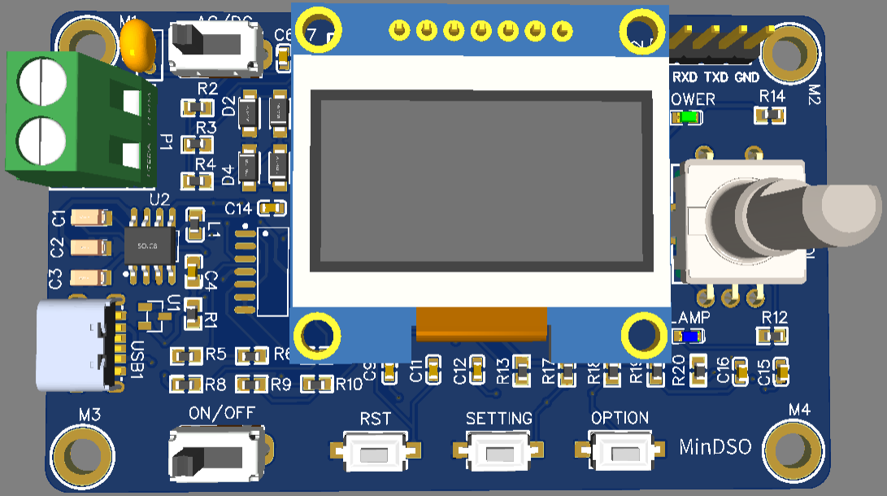
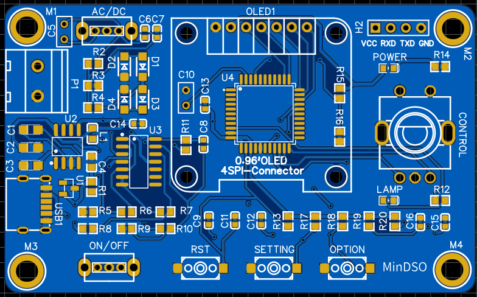
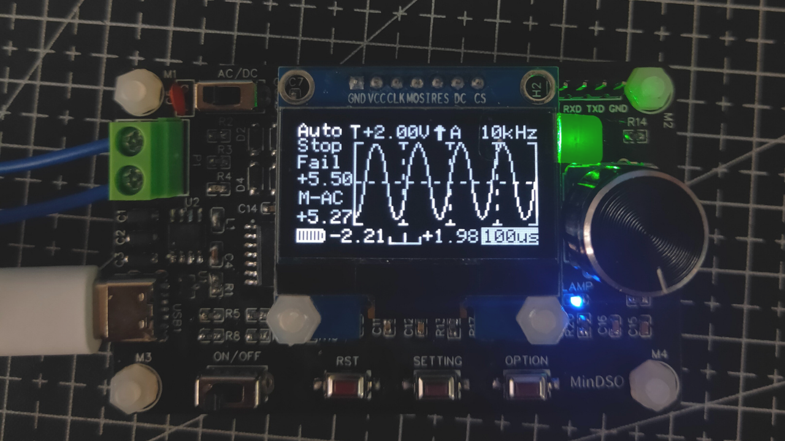
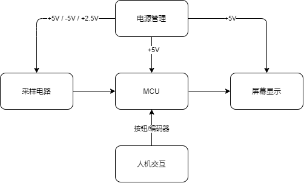

# MiniDSO-Pro

#### 介绍
B站老刘示波器Pro版本，在原版的基础上，扩展了测量负电压的功能，更新了UI设计，屏幕升级为1.3寸OLED屏。你可以在doc文件夹，获取设计报告和相关的芯片数据手册。

请大家务必给我个Star！！！这真的很重要！

B站视频演示：[点击我观看](https://www.bilibili.com/video/BV1M5411u7B6)

3D仿真效果图:


2D仿真效果图:


实物效果图:


#### 系统架构

Mini示波器采用了一套成本低廉但高效的硬件，配合层次化的软件框架，实现对常规低频信号波形的采集、分析、显示。

硬件部分的主要工作有：电源管理（5V、2.5V、-5V）；对信号的衰减、限幅、偏置。最后将处理好的电压信号送入MCU的ADC外设，进行数据采集。由于ADC外设只能采集正电压，因此我们通过增加偏置电压的方式，将负电压抬高来采集。

软件部分的主要工作有：底层驱动SDK框架、ADC滤波算法、波形数据处理、人机交互界面。SDK提供基本的模块和外设驱动支持，滤波算法去除噪声和毛刺，波形处理计算电压值和频率，并为波形显示做准备；人机交互界面提供屏幕显示（OLED屏）和操作方式（旋钮和按键）。




#### 与原版对比

这一版本的Mini示波器-Pro，相比于原版对硬件部分做了很大扩展，使其可以测到负电压。软件部分修改了有30%，主要是在数据处理和UI显示部分。

#### 调参教程

示波器采样的原理与原版一致，但是由于硬件上加了许多电路，导致信号呈非线性变化，因此需要对系统计算的结果进行处理。

这里提供两种办法：

##### 1. 对原采样方法进行改进
原版的采样模式，是利用了芯片自带的12位ADC进行采样，所以可以对ADC的采样函数进行优化。原版使用了查询法，通过循环等待采样完成标志位，获取采样结果。

频率的计算，是根据不同的采样时间（delay延时等待法），来分段计算频率值。这里可以通过定时器来控制采样时间，提高精确度。

##### 2. 对原采样结果上进行拟合

直接在原版的采样结果上进行数据拟合，这样做比较快捷，也是我用的方法（主要是赶时间）。但是误差较大，且需要测算的数据量有一点多。

具体的方法是，首先记录原采样的结果，电压幅度的刻度为0.5V，范围是从0V到20V。 频率的刻度为1KHz，范围是从0KHZ到20KHz。将测算的结果与输入的信号，一一对应拟合出计算公式，我采用的Excel来操作，选择的是对数函数来拟合，数据有误差。

具体需要拟合的函数在chart.c文件中，函数名称如下：

```C
/* 需要拟合数据的函数如下：*/
void getWaveFreq(void);
void AnalyseData(void);

/* 拟合数据的结果存放在如下变量：*/
VMax_m  /* 存放电压最大值 */
VMin_m  /* 存放电压最小值 */
Mvoltage  /* 存放电压平均值 */

WaveFreq   /* 存放频率值 */

```
开发者在调参的时候，可以屏蔽我的拟合代码，进行原方法采样结果的记录，然后进行数据拟合。我会在代码中进行标注，方便开发者查找和修改。


#### 需要改进的地方

1.硬件的性能还没有全部发挥出来，测量幅度还可以更高。
2.MCU的性能还没有榨干，比如没有用上硬件SPI，提高屏幕刷新率。

#### 开发后记

1.最一开始设想的方案，我是想用上我写的AntOS操作系统的，但是初版操作系统，为合作式调度，实际使用的过程中，并没有达到我的预期效果，所以选择在老刘示波器的基础工程上修改和优化。

2.硬件设计主要参考了B站`唐老师讲电赛`大佬提供的方案，实际使用的过程中，我又微调了一部分，建议大家可以去阅读一下硬件电路中使用的几种芯片数据手册，这样心里更有底，不然遇到问题不好排查。

3.大多数元器件，我用的都是0603的封装，这样可以让PCB板设计的更小巧更紧凑，但是不好焊接。

4.下一版本，我将使用STC8AxD4作为主控（因为有DMA）,软件上使用我现在编写AntOS（已支持抢占式调度），进一步提高示波器的性能。


####原版示波器Github仓库连接

[点击我跳转]( https://github.com/CreativeLau/Mini-DSO)